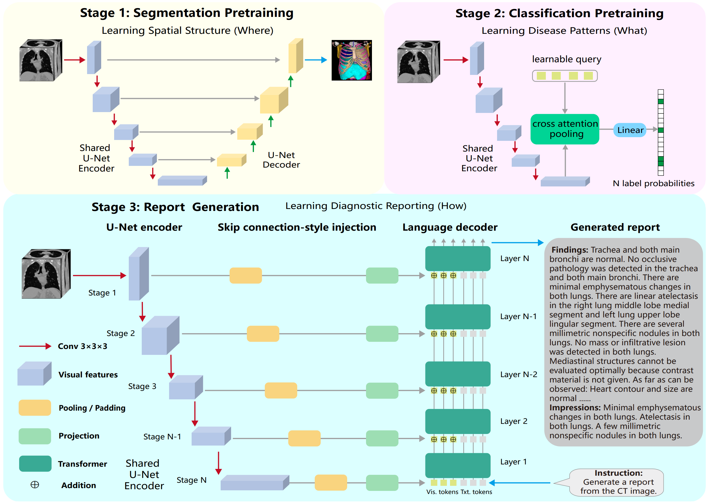

# U-VLM: Hierarchical Vision Language Modeling for Report Generation

<div align="center">

[]()
[](https://github.com/yinghemedical/U-VLM)
[](https://opensource.org/licenses/Apache-2.0)

</div>

### **U-VLM: Hierarchical Vision Language Modeling for Report Generation**

We propose U-VLM, which enables hierarchical vision-language modeling in both training and architecture: (1) progressive training from segmentation to classification to report generation, and (2) multi-layer visual injection that routes U-Net encoder features to corresponding language model layers. Each training stage can leverage different datasets without unified annotations. U-VLM achieves state-of-the-art performance on CT-RATE (F1: 0.414 vs 0.258, BLEU-mean: 0.349 vs 0.305) and AbdomenAtlas 3.0 (F1: 0.624 vs 0.518 for segmentation-based detection) using only a 0.1B decoder trained from scratch, demonstrating that well-designed vision encoder pretraining outweighs the benefits of 7B+ pre-trained language models.

> **Authors**: Pengcheng Shi¹, Minghui Zhang², Kehan Song¹, Jiaqi Liu¹, Yun Gu²✉, Xinglin Zhang¹✉
>
> **Affiliations**:
> ¹ Medical Image Insights Co. Ltd., Shanghai, China
> ² Shanghai Jiao Tong University, Shanghai, China
>
> **Paper**: Coming Soon

---

## 📰 Latest Updates

- **Feb 28, 2026**: 📄 Initial core code implementation released

---

## Introduction

Automated radiology report generation for 3D medical imaging is key for reducing radiologist workload and improving diagnostic consistency. However, generating accurate reports requires multi-scale visual understanding: global context for anatomical regions, and fine-grained details for lesion detection. Existing 3D medical VLMs inject visual features only at the input layer of language models, losing multi-scale information during generation. Furthermore, no prior end-to-end VLM leverages dense per-voxel supervision from segmentation.

<p align="center">
  
</p>

We propose U-VLM, a vision-language framework that enables hierarchical modeling in both training and architecture: (1) progressive training from segmentation to classification to report generation, and (2) multi-layer visual injection that routes U-Net encoder features to corresponding language model layers.

### Progressive Training

The shared U-Net encoder is sequentially optimized through three stages following curriculum learning:

- **Stage 1 - Segmentation Pretraining**: Learns spatial localization ("where") from segmentation annotations
- **Stage 2 - Classification Pretraining**: Recognizes disease patterns ("what") from classification labels
- **Stage 3 - Report Generation**: Generates reports ("how") from image-report pairs

Each stage can leverage **different datasets without unified annotations**.

### Multi-Layer Visual Injection

U-Net dominates segmentation precisely because its hierarchical encoder and skip connections preserve multi-scale information. Following U-Net skip connections, we inject features from each encoder stage into specific language model layers:

- **Deep encoder stages** → Early language layers (global semantics)
- **Shallow encoder stages** → Later language layers (fine-grained details)

This multi-layer injection extends U-Net's skip connections to vision-language modeling, preserving multi-scale information throughout generation.

### Results

U-VLM achieves F1 of 0.414 and BLEU-mean of 0.349 on CT-RATE, surpassing BTB3D (F1: 0.258, BLEU-mean: 0.305), and outperforms both end-to-end methods and segmentation-based detection on AbdomenAtlas 3.0 (F1: 0.624 vs 0.518). U-VLM uses only a 0.1B decoder trained from scratch, while compared methods use 7B+ pre-trained models.

| Dataset | F1 | BLEU-mean | Decoder |
|---------|-------|-----------|---------|
| **CT-RATE** | **0.414** vs 0.258 | **0.349** vs 0.305 | 0.1B (scratch) |
| **AbdomenAtlas 3.0** | **0.624** vs 0.518 | **0.437** | 0.1B (scratch) |

---

## Model Architecture

U-VLM trains a shared U-Net encoder through three progressive stages, then connects it to a language decoder via multi-layer visual injection:

### Network Components

**Vision Encoder: Residual U-Net**
- 6-stage hierarchical encoder with features [32, 64, 128, 256, 320, 320]
- Stage 1: Full U-Net learns fine-grained spatial structures through dense per-voxel supervision
- Stage 2: Decoder replaced with classification head using learnable query vectors and cross-attention

**Language Decoder:**
- Lightweight decoder: 0.1B parameters, 8 layers, 512 hidden dim, 8 heads (trained from scratch)
- Alternative: Qwen3-4B with LoRA (rank 64, α=128) or full fine-tuning (configurable via `use_lora` parameter)

**Multi-Layer Visual Injection:**
- Routes U-Net encoder features to corresponding language model layers
- Deep encoder stages (global semantics) → Early language layers
- Shallow encoder stages (fine-grained details) → Later language layers
- Hybrid attention: vision tokens bidirectional, text tokens causal

### Datasets

**CT-RATE**: 25,692 chest CT volumes with reports and 18-class multi-label abnormality classification

**AbdomenAtlas 3.0**: 9,262 abdominal CT volumes with per-voxel lesion annotations, 38 fine-grained anatomy classes, structured reports, and 3-class lesion classification

---

## 🔧 Setup

### Step 1: Environment Creation

```bash
conda create -n uvlm python=3.10
conda activate uvlm
```

### Step 2: PyTorch Installation

Install PyTorch matching your CUDA version. Example for CUDA 12.4:

```bash
pip install torch==2.6.0 torchvision==0.21.0 torchaudio==2.6.0 --index-url https://download.pytorch.org/whl/cu124
```

For other configurations, refer to the [PyTorch installation guide](https://pytorch.org/get-started/previous-versions/).

### Step 3: Install nnU-Net v2

U-VLM extends the nnU-Net v2 framework:

```bash
git clone https://github.com/MIC-DKFZ/nnUNet.git
cd nnUNet
pip install -e .
```

### Step 4: Install U-VLM

```bash
git clone https://github.com/yinghemedical/U-VLM.git
cd U-VLM
pip install -e .
```

### Step 5: Evaluation Tools (Optional)

For computing classification and report generation metrics:

```bash
pip install scikit-learn
pip install git+https://github.com/salaniz/pycocoevalcap.git
```

---

## 🚀 Quick Start

### Data Preparation

#### CT-RATE Dataset (Chest CT)

Preprocess the CT-RATE dataset for training:

```bash
# Full pipeline: resize + reports + classification + merge
python -m uvlm.preprocessing.preprocess_ct_rate_cls_report \
    --config-path /path/to/ct_rate_config.json \
    all --train-input-dir /path/to/train --val-input-dir /path/to/val \
        --output-dir /path/to/output \
        --reports-input-dir /path/to/reports \
        --cls-input-dir /path/to/classification

# Or run individual steps:
# Step 1: Resize nii.gz to blosc2
python -m uvlm.preprocessing.preprocess_ct_rate_cls_report \
    --config-path /path/to/ct_rate_config.json \
    resize --input-dir /path/to/nii_files --output-dir /path/to/output

# Step 2: Process reports
python -m uvlm.preprocessing.preprocess_ct_rate_cls_report \
    --config-path /path/to/ct_rate_config.json \
    reports --input-csv /path/to/reports.csv --output-csv /path/to/output.csv \
            --blosc2-dir /path/to/imagesTr
```

#### AbdomenAtlas 3.0 Dataset (Abdominal CT)

Preprocess the AbdomenAtlas 3.0 dataset:

```bash
# Full segmentation pipeline: merge masks + resize to blosc2
python -m uvlm.preprocessing.preprocess_abdomen_seg \
    --config-path /path/to/abdomen_atlas_config.json \
    all --input-dir /path/to/AbdomenAtlas \
        --raw-output-dir /path/to/nnUNet_raw \
        --preprocessed-output-dir /path/to/nnUNet_preprocessed

# Classification and report pipeline
python -m uvlm.preprocessing.preprocess_abdomen_cls_report \
    --config-path /path/to/abdomen_atlas_config.json \
    all --mask-only-dir /path/to/mask_only \
        --image-only-dir /path/to/image_only \
        --meta-csv /path/to/metadata.csv \
        --images-dir /path/to/preprocessed_images \
        --split-dir /path/to/TrainTestIDS \
        --output-dir /path/to/output
```

#### ReXGroundingCT Dataset (Chest Segmentation)

```bash
python -m uvlm.preprocessing.preprocess_rexgrounding_seg \
    --config-path /path/to/rexgrounding_ct_config.json \
    all --raw-input-dir /path/to/nnUNet_raw \
        --output-dir /path/to/nnUNet_preprocessed
```

**Output**: CSV files containing `blosc2_path`, disease labels, and radiology reports.

#### Storage Format

U-VLM employs **Blosc2 compression** (`.b2nd` format) for efficient storage and loading:

```python
import blosc2
import numpy as np

# Compress and save 3D volume
volume = np.random.randn(192, 256, 256).astype(np.float32)
blosc2.save_array(volume, "scan.b2nd", mode='w')

# Load compressed volume
volume = np.asarray(blosc2.open("scan.b2nd"))
```

**CSV Structure**:
```csv
series_id,case_id,blosc2_path,disease_1,disease_2,...,report
scan_001_1,case_001,/data/scan.b2nd,0,1,...,"Findings: ..."
```

### Training Workflow

Follow these three sequential stages for progressive training:

#### Stage 1: Segmentation Pretraining

Train the complete U-Net architecture for dense spatial structure learning:

```bash
nnUNetv2_train DATASET_ID 3d_fullres FOLD -tr nnUNetTrainer_ResEncoderUNet
```

This stage learns fine-grained anatomical structures through per-voxel segmentation supervision.

#### Stage 2: Classification Pretraining

Replace decoder with classification head for disease pattern recognition:

```bash
nnUNetv2_train DATASET_ID 3d_fullres FOLD -tr nnUNetTrainer_UVLM \
    --mode only_cls
```

The encoder can be frozen or fine-tuned while the classification head learns multi-label disease predictions.

#### Stage 3: Report Generation Training

Attach language decoder and train end-to-end for report generation:

```bash
# Default: 0.1B lightweight decoder (recommended)
nnUNetv2_train DATASET_ID 3d_fullres FOLD -tr nnUNetTrainer_UVLM \
    --mode only_report

# Alternative: Qwen3-4B with LoRA fine-tuning (default)
nnUNetv2_train DATASET_ID 3d_fullres FOLD -tr nnUNetTrainer_UVLM_Qwen3

# Alternative: Qwen3-4B with full parameter fine-tuning
# Set use_lora=False in the plan's network_arch_init_kwargs
nnUNetv2_train DATASET_ID 3d_fullres FOLD -tr nnUNetTrainer_UVLM_Qwen3
```

**Qwen3 Training Modes:**
- **LoRA fine-tuning** (`use_lora=True`, default): Only trains LoRA adapters, memory efficient
- **Full fine-tuning** (`use_lora=False`): Trains all parameters, requires more GPU memory

### Running Inference

#### Disease Classification

Python API for multi-label disease classification:

```python
import torch
from uvlm.inference.predict_cls import nnUNetPredictor

# Setup predictor
predictor = nnUNetPredictor(device=torch.device('cuda'))
predictor.initialize_from_trained_model_folder(model_dir)

# Run classification
disease_probabilities = predictor.predict_single_npy(input_image)
```

#### Report Generation (Distributed)

Multi-GPU inference for efficient report generation:

```bash
python -m uvlm.inference.inference_reportgen \
    --csv-path /path/to/test.csv \
    --checkpoint-path /path/to/checkpoint_best.pth \
    --gpu-config "0:2,1:2"  # 2 workers each on GPU 0 and GPU 1
```

### Performance Evaluation

#### Classification Evaluation

Compute macro-averaged precision, recall, and F1 scores:

```bash
python -m uvlm.evaluation.evaluate \
    --task cls \
    --gt-csv ground_truth.csv \
    --pred-csv predictions.csv \
    --output-dir results/
```

**Reported Metrics**: Macro Precision, Macro Recall, Macro F1

#### Report Generation Evaluation

```bash
python -m uvlm.evaluation.evaluate \
    --task report \
    --gt-csv ground_truth.csv \
    --pred-csv predictions.csv \
    --output-dir results/
```

**Reported Metrics**: BLEU-1, BLEU-2, BLEU-3, BLEU-4, and additional NLP metrics

---

## Hyperparameter Configuration

Example configuration for `network_arch_init_kwargs`:

```python
{
    "mode": "both",  # Options: "only_cls", "only_report", "both"
    "csv_paths": ["/path/to/training_data.csv"],
    "cls_columns": ["Liver lesion", "Kidney lesion", "Pancreas lesion"],  # Disease labels
    "report_column": "report",
    "llm_embed_dim": 512,       # Language model hidden dimension
    "num_heads": 8,              # Number of attention heads
    "initial_lr": 2e-5,          # Initial learning rate
}
```

---

## 🗺️ Development Roadmap

- [ ] **Paper Publication**: arXiv preprint release
- [x] **Core Implementation**: Base code and architecture released
- [ ] **Data Processing Scripts**: Complete preprocessing pipelines for CT-RATE, AbdomenAtlas 3.0, and ReXGroundingCT
- [ ] **Training Scripts**: Full multi-stage training codebase
- [ ] **Inference Scripts**: Comprehensive inference and evaluation code
- [ ] **Custom Fine-tuning**: Documentation and scripts for adaptation to new datasets

---

## 📖 Citation

If U-VLM contributes to your research, please cite our work:

```bibtex
@article{shi2026uvlm,
  title={U-VLM: Hierarchical Vision Language Modeling for Report Generation},
  author={Shi, Pengcheng and Zhang, Minghui and Song, Kehan and Liu, Jiaqi and Gu, Yun and Zhang, Xinglin},
  journal={arXiv preprint arXiv:xxxx.xxxxx},
  year={2026}
}
```

---

## 📄 License

This project is licensed under the Apache License 2.0 - see the [LICENSE](LICENSE) file for details.

---

## 🙏 Acknowledgements

U-VLM builds upon the robust [nnU-Net](https://github.com/MIC-DKFZ/nnUNet) framework. We are grateful to the nnU-Net development team for their foundational contributions to medical image segmentation. This work is developed and maintained by Medical Image Insights Co. Ltd. and Shanghai Jiao Tong University.

<div align="center">
  
  
</div>

---

## 💬 Contact

For questions, issues, or collaborations, please contact:

📧 **Pengcheng Shi**: shipc1220@gmail.com
📧 **Xinglin Zhang**: xinglinzh@gmail.com
📧 **Yun Gu**: geron762@sjtu.edu.cn

🐛 **Issues**: [GitHub Issue Tracker](https://github.com/yinghemedical/U-VLM/issues)
