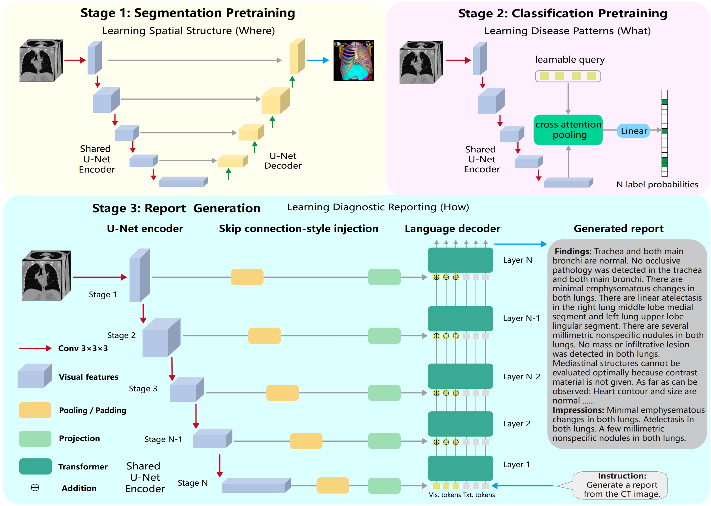

# U-VLM: Hierarchical Vision Language Modeling for Report Generation

<div align="center">

[](https://arxiv.org/abs/2603.00479)
[](https://github.com/yinghemedical/U-VLM)
[](https://opensource.org/licenses/Apache-2.0)

</div>

### **U-VLM: Hierarchical Vision Language Modeling for Report Generation**

We propose U-VLM, which enables hierarchical vision-language modeling in both training and architecture: (1) progressive training from segmentation to classification to report generation, and (2) multi-layer visual injection that routes U-Net encoder features to corresponding language model layers. Each training stage can leverage different datasets without unified annotations. U-VLM achieves state-of-the-art performance on CT-RATE (F1: 0.414 vs 0.258, BLEU-mean: 0.349 vs 0.305) and AbdomenAtlas 3.0 (F1: 0.624 vs 0.518 for segmentation-based detection) using only a 0.1B decoder trained from scratch, demonstrating that well-designed vision encoder pretraining outweighs the benefits of 7B+ pre-trained language models.

> **Authors**: Pengcheng Shi¹, Minghui Zhang², Kehan Song¹, Jiaqi Liu¹, Yun Gu²✉, Xinglin Zhang¹✉
>
> **Affiliations**:
> ¹ Medical Image Insights Co. Ltd., Shanghai, China
> ² Shanghai Jiao Tong University, Shanghai, China
>
> **Paper**: [arXiv:2603.00479](https://arxiv.org/abs/2603.00479)

---

## Latest Updates

- **Apr 30, 2026**: Full pipeline release — setup, preprocessing, training, inference, evaluation for all tasks
- **Feb 28, 2026**: Initial core code implementation released

---

## Introduction

Automated radiology report generation for 3D medical imaging is key for reducing radiologist workload and improving diagnostic consistency. However, generating accurate reports requires multi-scale visual understanding: global context for anatomical regions, and fine-grained details for lesion detection. Existing 3D medical VLMs inject visual features only at the input layer of language models, losing multi-scale information during generation. Furthermore, no prior end-to-end VLM leverages dense per-voxel supervision from segmentation.

<p align="center">
  
</p>

We propose U-VLM, a vision-language framework that enables hierarchical modeling in both training and architecture: (1) progressive training from segmentation to classification to report generation, and (2) multi-layer visual injection that routes U-Net encoder features to corresponding language model layers.

### Progressive Training

The shared U-Net encoder is sequentially optimized through three stages following curriculum learning:

- **Stage 1 - Segmentation Pretraining**: Learns spatial localization ("where") from segmentation annotations
- **Stage 2 - Classification Pretraining**: Recognizes disease patterns ("what") from classification labels
- **Stage 3 - Report Generation**: Generates reports ("how") from image-report pairs

Each stage can leverage **different datasets without unified annotations**.

### Multi-Layer Visual Injection

U-Net dominates segmentation precisely because its hierarchical encoder and skip connections preserve multi-scale information. Following U-Net skip connections, we inject features from each encoder stage into specific language model layers:

- **Deep encoder stages** → Early language layers (global semantics)
- **Shallow encoder stages** → Later language layers (fine-grained details)

This multi-layer injection extends U-Net's skip connections to vision-language modeling, preserving multi-scale information throughout generation.

### Results

U-VLM achieves F1 of 0.414 and BLEU-mean of 0.349 on [CT-RATE](https://huggingface.co/datasets/ibrahimhamamci/CT-RATE), surpassing BTB3D (F1: 0.258, BLEU-mean: 0.305), and outperforms both end-to-end methods and segmentation-based detection on [AbdomenAtlas 3.0](https://huggingface.co/datasets/AbdomenAtlas/AbdomenAtlas3.0Mini) (F1: 0.624 vs 0.518). U-VLM uses only a 0.1B decoder trained from scratch, while compared methods use 7B+ pre-trained models.

| Dataset | F1 | BLEU-mean | Decoder |
|---------|-------|-----------|---------|
| **CT-RATE** | **0.414** vs 0.258 | **0.349** vs 0.305 | 0.1B (scratch) |
| **AbdomenAtlas 3.0** | **0.624** vs 0.518 | **0.437** | 0.1B (scratch) |

---

## Model Architecture

U-VLM trains a shared U-Net encoder through three progressive stages, then connects it to a language decoder via multi-layer visual injection:

### Network Components

**Vision Encoder: Residual U-Net**
- 6-stage hierarchical encoder with features [32, 64, 128, 256, 320, 320]
- Stage 1: Full U-Net learns fine-grained spatial structures through dense per-voxel supervision
- Stage 2: Decoder replaced with classification head using learnable query vectors and cross-attention

**Language Decoder:**
- Lightweight decoder: 0.1B parameters, 8 layers, 512 hidden dim, 8 heads (trained from scratch)
- Alternative: Qwen3-4B with LoRA (rank 64, α=128) or full fine-tuning (configurable via `use_lora` parameter)

**Multi-Layer Visual Injection:**
- Routes U-Net encoder features to corresponding language model layers
- Deep encoder stages (global semantics) → Early language layers
- Shallow encoder stages (fine-grained details) → Later language layers
- Hybrid attention: vision tokens bidirectional, text tokens causal

### Datasets

**CT-RATE**: 25,692 chest CT volumes with reports and 18-class multi-label abnormality classification

**AbdomenAtlas 3.0**: 9,262 abdominal CT volumes with per-voxel lesion annotations, 38 fine-grained anatomy classes, structured reports, and 3-class lesion classification

---

## Setup

### One-Click Setup

```bash
git clone https://github.com/yinghemedical/U-VLM.git
cd U-VLM
bash uvlm/scripts/setup_env.sh
```

This script auto-detects your conda/nnUNet paths and creates a `uvlm` environment with all dependencies. Customize with environment variables:

```bash
ENV_NAME=my_uvlm NNUNET_DIR=/path/to/nnUNet bash uvlm/scripts/setup_env.sh
```

### Manual Setup

```bash
conda create -n uvlm python=3.10
conda activate uvlm

# PyTorch (CUDA 12.4)
pip install torch torchvision torchaudio --index-url https://download.pytorch.org/whl/cu124

# nnU-Net v2
git clone https://github.com/MIC-DKFZ/nnUNet.git
cd nnUNet && pip install -e . && cd ..

# U-VLM
cd U-VLM && pip install -e .
```

See `uvlm/scripts/setup_env.sh` for the complete dependency list.

---

## Quick Start

Example scripts for each stage are in `uvlm/scripts/` — adapt paths and run directly:

```bash
bash uvlm/scripts/run_preprocess.sh   # raw data → Blosc2 + CSV
bash uvlm/scripts/run_train.sh        # progressive 3-stage training
bash uvlm/scripts/run_inference.sh    # generate predictions
bash uvlm/scripts/run_evaluate.sh     # compute metrics
```

Or use the CLI commands directly:

### Preprocessing

Convert raw images to Blosc2 format and generate training CSVs. Config templates are in `uvlm/preprocessing/configs/`.

```bash
# Chest segmentation (ReXGroundingCT)
python -m uvlm.preprocessing.preprocess_rexgrounding_seg \
    --config-path uvlm/preprocessing/configs/rexgrounding_ct_config.json \
    all --raw-input-dir /path/to/raw --output-dir /path/to/preprocessed

# Chest classification + report (CT-RATE)
python -m uvlm.preprocessing.preprocess_ct_rate_cls_report \
    --config-path uvlm/preprocessing/configs/ct_rate_config.json \
    all --train-input-dir /path/to/train --val-input-dir /path/to/val \
        --output-dir /path/to/preprocessed

# Abdomen segmentation + classification + report (AbdomenAtlas 3.0)
python -m uvlm.preprocessing.preprocess_abdomen_seg \
    --config-path uvlm/preprocessing/configs/abdomen_atlas_config.json \
    all --input-dir /path/to/data --output-dir /path/to/preprocessed
python -m uvlm.preprocessing.preprocess_abdomen_cls_report \
    --config-path uvlm/preprocessing/configs/abdomen_atlas_config.json \
    all --images-dir /path/to/images --output-dir /path/to/preprocessed
```

See `uvlm/examples/datasets/` for 20-case example CSVs and dataset.json files for each dataset (Dataset200 — Chest Segmentation, Dataset201 — Chest Classification/Report, Dataset202 — Abdomen).

### Training

Progressive three-stage training. First, generate a plan from the template for your dataset:

```bash
python uvlm/scripts/generate_plans.py \
    --template uvlm/configs/plans/UVLM_ResEncUNetLPlans_chest_seg_basic.json \
    --output /path/to/nnUNet_preprocessed/DatasetXXX/UVLM_ResEncUNetLPlans.json \
    --var PREPROCESSED_DIR=/path/to/nnUNet_preprocessed \
    --var DATASET_NAME=DatasetXXX \
    --var CSV_FILE=train_merged.csv
```

Then train progressively (each stage loads the previous checkpoint):

```bash
# Stage 1: Segmentation
uvlm_train DatasetXXX 3d_fullres 0 \
    -tr nnUNetTrainer_ResEncoderUNet \
    -p UVLM_ResEncUNetLPlans_chest_seg_basic

# Stage 2: Classification (load seg checkpoint)
uvlm_train DatasetXXX 3d_fullres 0 \
    -tr nnUNetTrainer_UVLM \
    -p UVLM_ResEncUNetLPlans_chest_cls \
    --pretrained_encoder_checkpoint_path /path/to/seg_checkpoint.pth

# Stage 3: Report generation (load cls checkpoint)
uvlm_train DatasetXXX 3d_fullres 0 \
    -tr nnUNetTrainer_UVLM \
    -p UVLM_ResEncUNetLPlans_chest_report \
    --pretrained_encoder_checkpoint_path /path/to/cls_checkpoint.pth
```

Available plan templates in `uvlm/configs/plans/`:

| Template | Stage | Anatomy |
|----------|-------|---------|
| `*_chest_seg_basic.json` | Segmentation | Chest |
| `*_chest_cls.json` | Classification | Chest |
| `*_chest_report.json` | Report Gen | Chest |
| `*_abdomen_seg_basic.json` | Segmentation | Abdomen |
| `*_abdomen_cls.json` | Classification | Abdomen |
| `*_abdomen_report.json` | Report Gen | Abdomen |

### Inference

```bash
# Segmentation
uvlm_inference seg \
    --csv-path /path/to/test.csv \
    --model-dir /path/to/model \
    --output-dir /path/to/output

# Classification
uvlm_inference cls \
    --csv-path /path/to/test.csv \
    --model-dir /path/to/model \
    --output-dir /path/to/output \
    --gpu-config "0:1"

# Report generation
uvlm_inference report \
    --csv-path /path/to/test.csv \
    --model-dir /path/to/model \
    --output-dir /path/to/output \
    --gpu-config "0:1"
```

### Evaluation

```bash
# Segmentation (Dice)
uvlm_evaluate seg \
    --gt-csv gt.csv --predictions predictions.json --output-dir results/

# Classification (F1 / Recall / Precision per class)
uvlm_evaluate cls \
    --gt-csv gt.csv --pred-csv predictions.csv --output-dir results/

# Report generation (BLEU)
uvlm_evaluate report \
    --gt-csv gt.csv --pred-csv predictions.csv --output-dir results/
```

Output: `metrics_seg.json`, `metrics_cls.json`, or `metrics_nlg.json`.

---

## Citation

If U-VLM contributes to your research, please cite our work:

```bibtex
@article{shi2026u,
  title={U-VLM: Hierarchical Vision Language Modeling for Report Generation},
  author={Shi, Pengcheng and Zhang, Minghui and Song, Kehan and Liu, Jiaqi and Gu, Yun and Zhang, Xinglin},
  journal={arXiv preprint arXiv:2603.00479},
  year={2026}
}
```

---

## License

This project is licensed under the Apache License 2.0 - see the [LICENSE](LICENSE) file for details.

---

## Acknowledgements

U-VLM builds upon the robust [nnU-Net](https://github.com/MIC-DKFZ/nnUNet) framework. We are grateful to the nnU-Net development team for their foundational contributions to medical image segmentation. This work is developed and maintained by Medical Image Insights Co. Ltd. and Shanghai Jiao Tong University.

<div align="center">
  
  
</div>

---

## Contact

If you have any questions or encounter any issues, please feel free to reach out via our [GitHub Issue Tracker](https://github.com/yinghemedical/U-VLM/issues).
